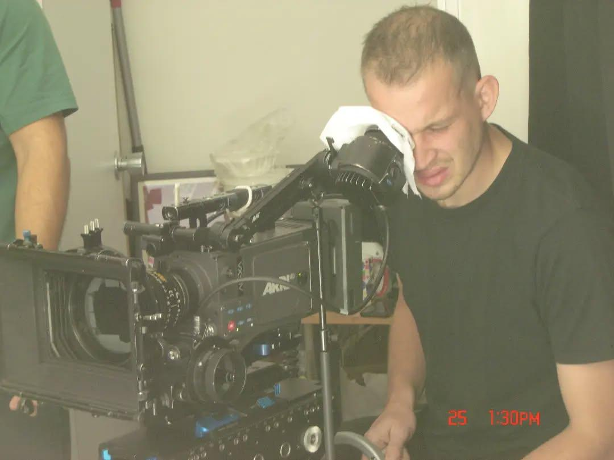

His first fictional short “I Was Never Really Here” (Gabriel Arrahnio, 2022) was shot on 16mm film, rated particularly valuable by <ExternalLink href='https://www.fbw-filmbewertung.com/film/i_was_never_really_here'>Deutsche Film- und Medienbewertung Prädikat: Besonders Wertvoll</ExternalLink>, nominated for <ExternalLink href='https://kurzfilmtournee.de/de/filme/3434.html'>Deutscher Kurzfilmpreis 2023</ExternalLink> and received numerous festival screenings (e.g. at <ExternalLink href='https://mubi.com/de/de/films/i-was-never-really-here'>ISFF Clermont-Ferrand </ExternalLink>), as well as winning several awards, among them "[Outstanding Cinematropgrahy](https://www.imdb.com/event/ev0001748/2024/1/?ref_=nmawd_1)"

In 2022, Georg received a DAAD scholarship to study in Mexico City at the renowned film school Centro de Capacitación Cinematográfica (CCC), where he learned from Mexican filmmakers and broadened his perspective on cinematic storytelling and camera work. During this time, he refined his operating skills - working with the Arrihead among others - under the guidance of Mercedes Porter Hope, who has collaborated with directors such as Alfonso Cuarón and Paolo Sorrentino. Through her mentorship, Georg developed a nuanced command of precise, fluid camera movements — echoing the visual language of films like “ROMA” (Alfonso Cuarón, 2018).

He completed his Bachelor's degree in Cinematography at Film University Babelsberg KONRAD WOLF in Potsdam with the feature-length road movie “Alma Blu” (Alice Palchetti, 2025), shot in Italy and supervised by Sophie Maintignieux, which premiered at the Split Film Festival in 2025. Following another study period abroad at ESCAC and UAB in Barcelona, where he explored the Catalan approach to visual storytelling, he is now developing his Master’s thesis feature film in Berlin.

Georg lives and works in Berlin, where he is active across various artistic fields - particularly within the music community - while completing his Master’s in Cinematography. He is always open to new collaborations and creative challenges - feel free to get in touch anytime.

