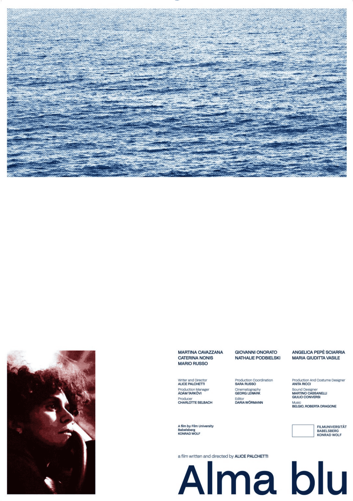

<!--  -->

Forced to return to Italy for her sister’s wedding, Alma leaves behind Berlin and a faltering relationship. What begins as a simple family obligation soon turns into a journey of self-discovery. As she travels through landscapes both familiar and strange, unexpected encounters and familiar faces stir childhood memories and unresolved conflicts. Returning home becomes a metaphor for an inner journey toward a sense of belonging— one no longer tied to geography, but to a rediscovered authenticity. An intimate yet universal story about identity, the weight of one’s origins, and the quiet possibility of finding a place in the world—even when no place has ever truly felt like home.

### Awards & Festivals

- 14.09.2025 - Split Film Festival | Worldpremiere
- 25.09.2025 - <ExternalLink href='https://www.festivaldecinevalledeguadalupe.com/' ariaLabel='Festival de Cine del Valle de Guadalupe'>Festival de Cine del Valle de Guadalupe</ExternalLink> | South America Premiere
