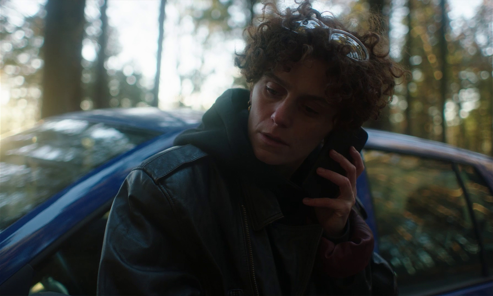

**ALMA**

WORK IN PROGRESS

A young woman's journey leads to her confrontation with her roots and acceptance of her hybrid identity.

Directed & Written by Alice Palchetti
Produced by Ádám Tarkövi, Charlotte Selbach and Sara Russo

<!-- <ExternalLink ariaLabel="Watch film" href='https://vimeo.com/764106187'>Watch film</ExternalLink> -->

<!--  -->

