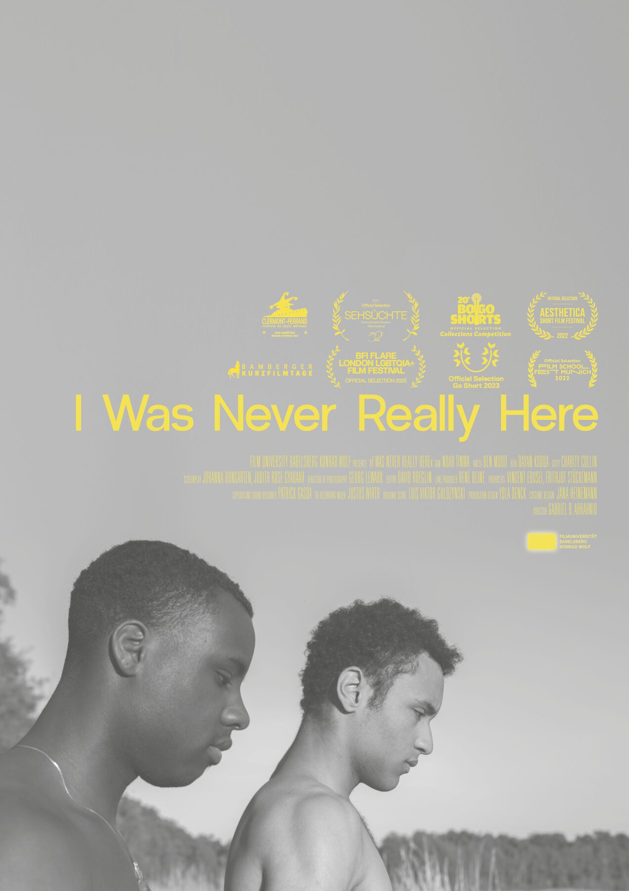

'Paisa' - short slang for Paisano - is today a highly contextual word with varying meaning, having either a negative or positive connotation depending on the person uttering it. Do25inco plays with this duality on the 3-track EP where he displays solidarity with other Paisanxs that live their life abroad. Coming from the neighborhood La Mancha 2 in Naucalpan, Mexico City, a place struck by poverty, violence and drugs, to Berlin, a safer city with more opportunities, he reflects on his past and describes a new chapter of the life he has grown into.

<!-- 

<ExternalLink ariaLabel="Watch film" href='https://www.youtube.com/watch?v=qRezz3J1Hmw'>Watch film</ExternalLink>

 -->
